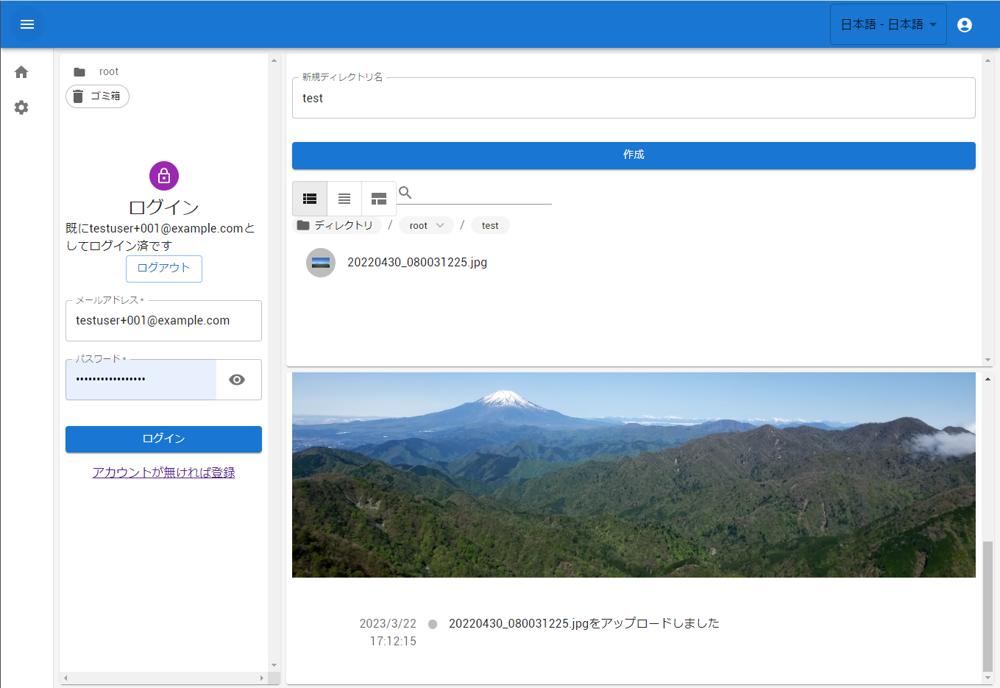

# E2EENCLOUD (α版)

E2E暗号化を実装したWebストレージアプリケーション



## 使い方

```
./build-frontend.sh
docker compose up -d
```

`./build-frontend.sh`でフロントエンドアプリケーションを作成する。実行は初回のみでよい

app.localhostを開く

## ディレクトリ構造

### tinyserver

Deno製アプリケーションサーバ（app.localhost/api以下に提供されます。）

### webcli

クライアントSPA（開発用更新サーバ付き）

## テスト環境の立ち上げ
最初に`tinyserver`を参考に`.env`をこのreadme.mdと同階層に作成する

`tinyserver`・`webcli`それぞれでVSCode等を利用しdevcontainerを立ち上げる。
それぞれのサーバを立ち上げれば[app.localhost]から利用できる。（ローカルの80番ポートを開けておくこと）
